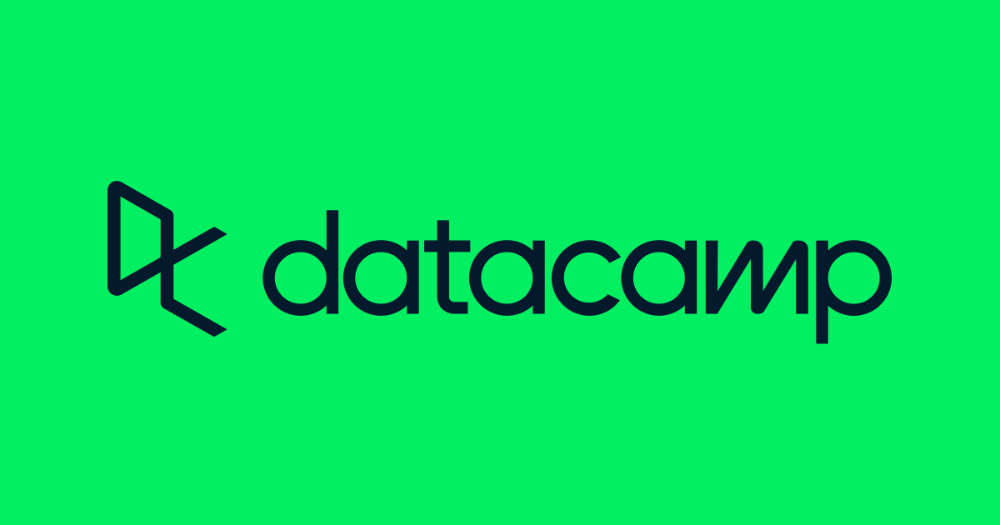

# Data Camp Associate Data Scientist in Python

The journey to becoming a Data Scientist is both exciting and enlightening. Through the Data Camp Associate Data Scientist in Python program, one can gain invaluable skills and knowledge that transform the understanding of data and its applications. This diary captures the progress and showcases the projects that illustrate the learning experience.

## Chapter 1: Introduction to Python 

The initial lessons focused on Python programming, covering the basics and some advanced features of the language. I revisited concepts such as loops, conditionals, and functions, and was introduced to powerful libraries like pandas and NumPy.
## Chapter 2: Intermediate Python

This chapter was crucial in enhancing my problem-solving skills and my ability to work with more complex data structures and algorithms.

### Project : Investigating Netflix Movies

Apply the foundational Python skills you learned in Introduction to Python and Intermediate Python by manipulating and visualizing movie data.

[Link to the project](/investigating-netflix-movies)

## Chapter 3: Data Manipulation with pandas

Learn how to import and clean data, calculate statistics, and create visualizations with pandas.

### Project : Exploring NYC Public School Test Result Scores

Use data manipulation and summary statistics to analyze test scores across New York City's public schools!

[Link to the project](/nyc-public-school)

## Chapter 4 : Joining Data with pandas

Learn to combine data from multiple tables by joining data together using pandas.